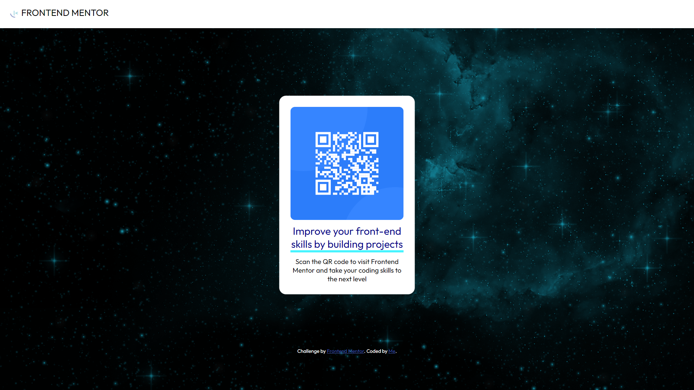

# Frontend Mentor - QR code component solution

This is a solution to the [QR code component challenge on Frontend Mentor](https://www.frontendmentor.io/challenges/qr-code-component-iux_sIO_H).  

# Table of contents

- [Overview]
  - [Notes]
  - [Screenshots]
  - [Links]
 

# Overview

## Notes

I opted to alter the original design by creating a new one. I hope you enjoy!

## Screenshots

PC Screenshot:

Mobile Screenshot:

## Links

- Solution URL: [Solution URL here](https://your-solution-url.com)
- Live Site URL: [Live site URL here](https://miguel-willians.github.io/QR_code_page/)

