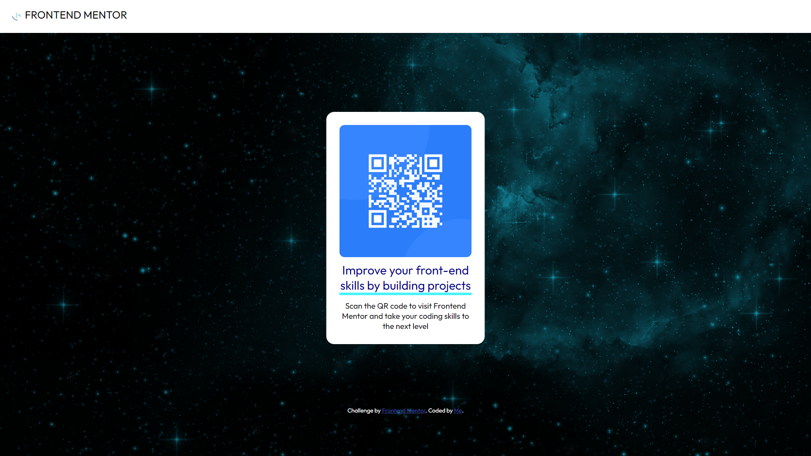
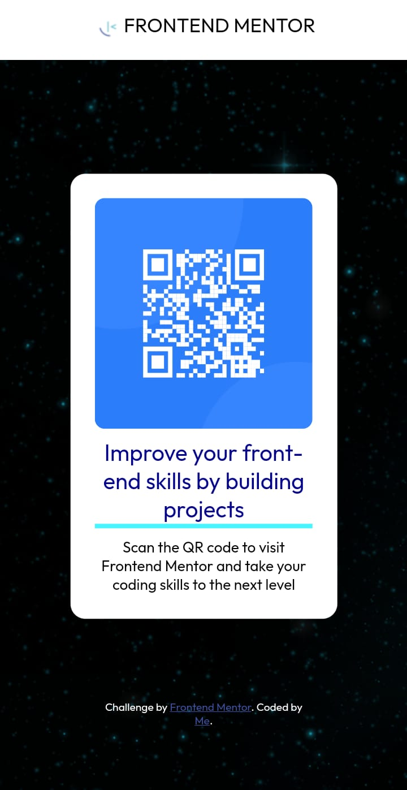

# Frontend Mentor - Solução do componente de QR code 🇧🇷

Esta é uma solução para o [desafio de componente de código QR no Frontend Mentor](https://www.frontendmentor.io/challenges/qr-code-component-iux_sIO_H).

# Índice

- [Vis√£o Geral]
  - [Notas]
  - [Capturas de Tela]
  - [Links]

# Vis√£o Geral

## Notas

Eu optei por alterar o design original criando um novo. Espero que você goste!

## Capturas de Tela

Captura de tela do PC:

Captura de tela do celular:

## Links

- URL da Solução: [URL da solução aqui](https://www.frontendmentor.io/solutions/qr-code-page-using-basic-html-and-css-mobile-responsive-_HC6qaoSAU)
- URL do Site ao Vivo: [URL do site ao vivo aqui](https://miguel-willians.github.io/QR_code_page/)

# Frontend Mentor - QR code component solution 🇺🇸

This is a solution to the [QR code component challenge on Frontend Mentor](https://www.frontendmentor.io/challenges/qr-code-component-iux_sIO_H).  

# Table of contents

- [Overview]
  - [Notes]
  - [Screenshots]
  - [Links]
 

# Overview

## Notes

I opted to alter the original design by creating a new one. I hope you enjoy!

## Screenshots

PC Screenshot:

Mobile Screenshot:

## Links

- Solution URL: [Solution URL here](https://www.frontendmentor.io/solutions/qr-code-page-using-basic-html-and-css-mobile-responsive-_HC6qaoSAU)
- Live Site URL: [Live site URL here](https://miguel-willians.github.io/QR_code_page/)
